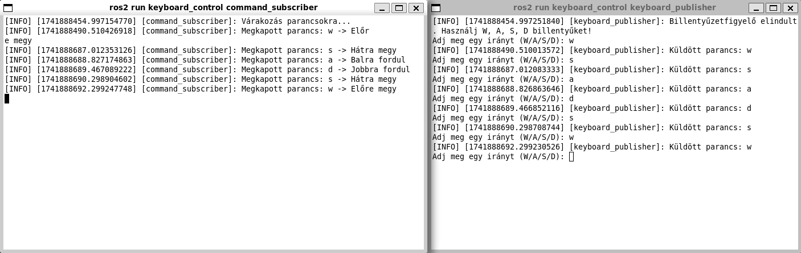

# Billentyűzetes Robotvezérlés

Ez a projekt egy egyszerű ROS 2 csomag (keyboard_control), amely lehetővé teszi a robot vezérlését billentyűleütések segítségével. A csomag két fő node-ból áll: egy publisher és egy subscriber node-ból.

## Fájlok
- **keyboard_publisher.py**: Figyeli a billentyűleütéseket, és a megfelelő vezérlési parancsokat elküldi a 'cmd_vel' témára.
- **command_subscriber.py**: Feliratkozik a 'cmd_vel' témára, és kiírja a kapott vezérlési parancsokat.
- **launch/keyboard_control_launch.py**: Egyszerre indítja el a két node-ot külön terminálablakban.

## Telepítés
1. Készítsd el a ROS 2 munkakörnyezetet:
   ```bash
   cd ~/ros2_ws/src
   ```
2. Klónozd a projektet vagy helyezd a forráskódot a `src` könyvtárba.
   ```bash
   git clone https://github.com/Karvaly120/kov_h5l_kisbeadando
   ```   
3. Lépj vissza a munkakönyvtárba:
   ```bash
   cd ~/ros2_ws
   ```
4. Buildeld a csomagot:
   ```bash
   colcon build --packages-select keyboard_control
   ```
   <details>
   <summary> Don't forget to source before ROS commands.</summary>

   ``` bash
   source ~/ros2_ws/install/setup.bash
   ```
</details>

## Használat
1. Indítsd el a billentyűzetes vezérlő node-ot:
   ```bash
   ros2 launch keyboard_control keyboard_control_launch.py
   ```

   ## Program működése

## Graph

Az alábbi diagram szemlélteti a billentyűzetes robotvezérlés működését:



